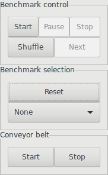

# Docker setup for RoboCup@Work competition

## Usage

It is assumed, that docker-compose is installed and X11 is present.
The refbox, including the client, can be started like this:

```bash
$ docker-compose up -d
# Creating robocuprefboxsetup_refbox-server_1 ... 
# Creating robocuprefboxsetup_refbox-server_1 ... done
# Creating robocuprefboxsetup_refbox-client_1 ... 
# Creating robocuprefboxsetup_viewer_1 ... 
# Creating robocuprefboxsetup_controller_1 ... 
# Creating robocuprefboxsetup_refbox-client_1
# Creating robocuprefboxsetup_viewer_1
# Creating robocuprefboxsetup_refbox-client_1 ... done
```
## Example

When started, the viewer and controller should look like this:




Select the controller and choose an arbitrary task to perform ("Reset" must be
clicked two times, in order to update the refbox state). In this example
"BNT1" is selected (basic navigation task).

The viewer should update:


In the refbox controller click "Start" and "Next". The viewer should update
accordingly:


To view published info about tasks to perform use:
```bash
$ docker run --rm -it --network host -w /home/ros/devel \
    mkerschbaumer/robocup_refbox_client_docker bash
$ source setup.bash; rostopic echo /robot_example_ros/task_info
# tasks: 
#   - 
#     id: 
#       data: 9
#     type: 
#       data: 2
#     status: 
#       data: 1
#     transportation_task: 
#       object: 
#         type: 
#           data: 0
#         type_id: 
#           data: 0
#         instance_id: 
#           data: 0
#         description: 
#           data: ''
#       container: 
#         type: 
#           data: 0
#         type_id: 
#           data: 0
#         instance_id: 
#           data: 0
#         description: 
#           data: ''
#       quantity_delivered: 
#         data: 0
# [...] (truncated)
```
